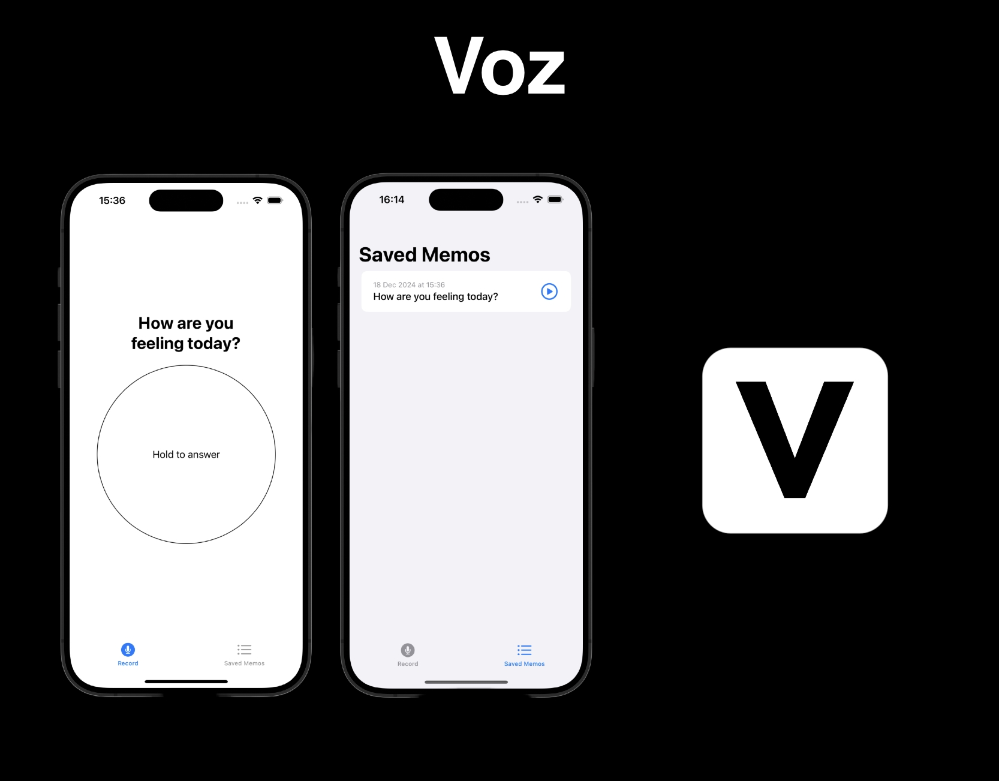

# Voz

_Document your day with a simple VoiceMemo and a prompted guide!_  

## Features
- [x] Record a VoiceMemo answering the daily question.
- [x] Get a history of your VoiceMemos.
- [x] Replay your memos to revisit your past days.

## Frameworks
- SwiftUI
- AVFoundation

## Developer
Eugenio Javier Lozano Benavides developed this app! :)
